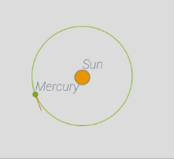
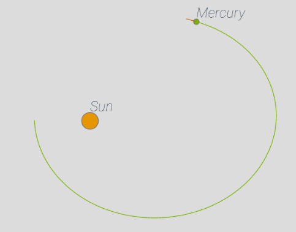

### Oversimplified Gravity Simulator


##### Introduction

​	A simple gravity simulator, based on [p5js](https://p5js.org/). [Click here](https://arnosolo.github.io/oversimplified_gravity_simulator/) to enter the demo page.


##### Change initial condition

​	You can find some predefined configuration in [initial_conditions](./initial_conditions) folder, include Solar system, Two Suns and Three Suns. You can also edit initial condition in demo page. Here is an example:

```json
[
  {
    "tag": "Sun", // name
    "pX": 0,      // init position
    "pY": -100,   // init position
    "vX": 0,      // init velocity
    "vY": 0,      // init velocity
    "mass": 6000,
    "radius": 12, // optional, default = 5
    "color": "#e69600", // optional, default = "#9c9891"
    "pathLenMax": 200, // trajectory length, optional, default = 300
  }
]
```
Note: you need to clear the comment to use the configuration, like this:

```json
[
    {
        "tag": "Sun",
        "pX": 0,
        "pY": -100,
        "vX": 0,
        "vY": 0,
        "mass": 6000,
        "radius": 12,
        "color": "#e69600",
        "pathLenMax": 200
  }
]
```


##### Q&A

1. How to calculate the speed of circular orbit?

   Let's say we have a Sun and a Mercury, and we want the Mercury orbit the Sun in circular, what speed should the Mercury has? What we need is this formula:

   

   G: Gravitational constant(default is 10)

   r: Distance

   v_mercury : Velocity of mercury relative to the sun

   * If Mercury's speed is equal to this speed it will orbit in circular

      

     ```json
     [{"tag":"Sun","pX":0,"pY":-100,"vX":0,"vY":0,"mass":6000,"radius":12,"color":"#e69600","pathLenMax":200},{"tag":"Mercury","pX":-80,"pY":-100,"vX":0,"vY":27.386,"mass":15,"radius":4,"color":"#78b400","pathLenMax":200}]
     ```

     

   * If Mercury's speed is greater than this speed it will orbit in ellipse, eventually, it will escape from the Sun(about 1.414 * v_mercury). Learn more about [escape velocity](https://en.wikipedia.org/wiki/Escape_velocity). 

      

     ```json
     [{"tag":"Sun","pX":0,"pY":-100,"vX":0,"vY":0,"mass":6000,"radius":12,"color":"#e69600","pathLenMax":200},{"tag":"Mercury","pX":-80,"pY":-100,"vX":0,"vY":34,"mass":15,"radius":4,"color":"#78b400","pathLenMax":200}]
     ```

     

   