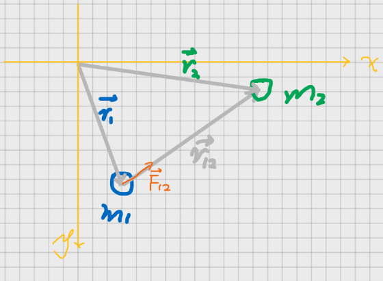
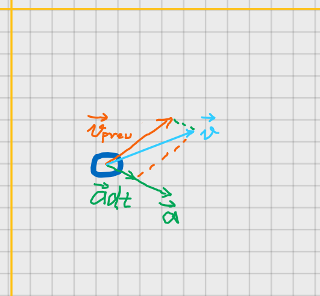
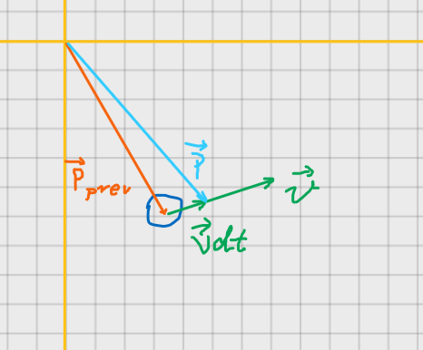
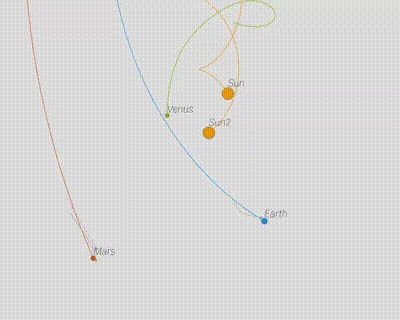
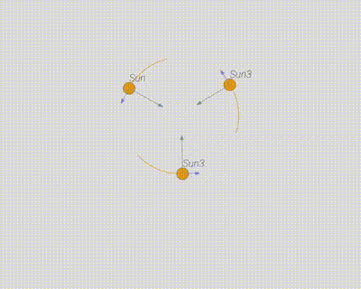
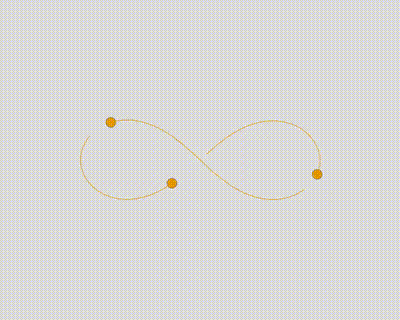

### Oversimplified Gravity Simulator


#### Introduction

​	A oversimplified gravity simulator, based on [p5js](https://p5js.org/). [Click here](https://arnosolo.github.io/oversimplified_gravity_simulator/) to enter the demo page. 

​	

#### How it Work

In each frame of animation, we 

1. Calculate the net force of each object, then calculate the acceleration according to the net force. Notice that force, distance are all vectors.

    

    

2. Calculate the speed according to the acceleration.

    

    

3. Calculate the position according to the speed. Then draw mover in new position.

    

    


#### Change initial condition

You edit initial condition with GUI in demo page. 

You can also find some predefined configuration in [initial_conditions](./initial_conditions) folder, include

* [Solar system](https://github.com/arnosolo/oversimplified_gravity_simulator/blob/master/initial_conditions/init_condition-solar_system.json) 

* [Two Suns](https://github.com/arnosolo/oversimplified_gravity_simulator/blob/master/initial_conditions/init_condition-dual_suns.json) 

   

* [three_bodies-triangle](https://github.com/arnosolo/oversimplified_gravity_simulator/blob/master/initial_conditions/init_condition-three_bodies-triangle.json) 

  (The only solution I can get)

   

* [three_bodies-figure_8_solution.json](https://github.com/arnosolo/oversimplified_gravity_simulator/blob/master/initial_conditions/init_condition-three_bodies-figure_8_solution.json) 

  (Find in [wiki]( \* https://en.wikipedia.org/wiki/Three-body_problem#cite_note-11))
  
   

Finally, the following explains the meaning of a config item (GUI is recommended)

```json
[
  {
    "tag": "Sun", # name
    "pX": 0,      # init position
    "pY": -100,   # init position
    "vX": 0,      # init velocity
    "vY": 0,      # init velocity
    "mass": 6000,
    "radius": 12, # optional, default is 5
    "color": "#e69600", # optional, default is "#9c9891"
    "pathLenMax": 200, # trajectory length, optional, default is 300
    "velScale": 1, # scale velocity arrow, default is 1
    "forceScale": 0.02 # scale force arrow, default is 0.02
  }
]
```
Note: If you want use the json config file, you need clear comments in it, like this:

```json
[
    {
        "tag": "Sun",
        "pX": 0,
        "pY": -100,
        "vX": 0,
        "vY": 0,
        "mass": 6000,
        "radius": 12,
        "color": "#e69600",
        "pathLenMax": 200
  }
]
```


#### Q&A

##### Circular orbit

1. How to calculate the speed of circular orbit?

   Let's say we have a Sun and a Mercury, and we want the Mercury orbit the Sun in circular, what speed should the Mercury has? What we need is this formula:

   

   G: Gravitational constant(default is 10)

   r: Distance

   v_mercury : Velocity of mercury relative to the sun

   * If Mercury's speed is equal to this speed it will orbit in circular

      

     [**initial_condition-circular_orbit_demo.json**](https://github.com/arnosolo/oversimplified_gravity_simulator/blob/master/initial_conditions/initial_condition-circular_orbit_demo.json) 
     
     

   * If Mercury's speed is greater than this speed it will orbit in ellipse, eventually, it will escape from the Sun(about 1.414 * v_mercury). Learn more about [escape velocity](https://en.wikipedia.org/wiki/Escape_velocity). 

      

     [**initial_condition-elliptical_orbit_demo.json**](https://github.com/arnosolo/oversimplified_gravity_simulator/blob/master/initial_conditions/initial_condition-elliptical_orbit_demo.json) 
   
     
   
   