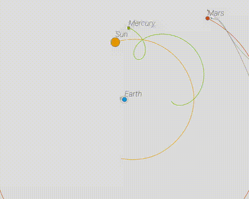

### Oversimplified Gravity Simulator



##### Introduction

​	A simple gravity simulator, based on [p5js](https://p5js.org/). [Click here](https://arnosolo.github.io/oversimplified_gravity_simulator/) to enter the demo page.


##### Change initial condition

​	You can find some Predefined configuration in initial_conditions, include Solar system, Two Suns and Three Suns.

```json
[
  {
    "tag": "Sun", // name
    "pX": 0,      // init position
    "pY": -100,   // init position
    "vX": 0,      // init velocity
    "vY": 0,      // init velocity
    "mass": 6000,
    "radius": 12,
    "color": "#e69600",
    "pathLenMax": 200
  }
]
```


